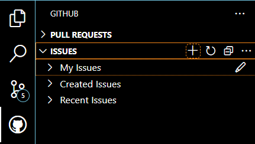

# Accessing repository
1. Join to repository from the invitation mail.
2. Install Github Pull Requests extension.
    
    

3. Login to GitHub account from VS Code.
    
    

4. Clone repository in your device.
    
    

# Create issue
1. Inside VS Code, go to GitHub tab and open ISSUES dropdown. Then click on + sign.

    

2. Add title, description, assignees, milestone, labels and then click on the ✓ symbol to raise the issue.

    

# Address the issue
1. In VS Code, go to GitHub tab and open ISSUES dropdown. You will see the currently open issues. 
> [!TIP] 
> Refresh🗘 if you don't see any issues 

1. Click on the → arrow next to the issue you want to address to.

    

2. You will see the newly created branch at the bottom. Click on Publish branch.
 
    

3. Then add new files or make any changes you want in the project files.
4. Now go to Source Control tab in VS Code, and stage the changes you want to commit to github, by clicking on the + sign.
   
    

5. Then click on the create pull request button at the top.\
    
6. Now verify the branch you are currently in (newly created branch for the issue), the base branch you want to merge into (main), then enter the title, description (#issue_number - issues you have fixed as well as more information), add reviewer (from the symbol at the top), and then click on Create. (Click on Commit changes is the prompt asks.)

    

    > To link a pull request to an issue to show that a fix is in progress and to automatically close the issue when someone merges the pull request, type one of the following keywords followed by a reference to the issue.
    > - close
    > - closes
    > - closed
    > - fix
    > - fixes
    > - fixed
    > - resolve
    > - resolves
    > - resolved
  
7. Wait for reviewer to check your work. If the reviewer requests changes, you need to fix those and then re-request for the review. If the request is approved, you can merge the branch.

    

    Or you can click on Create Merge Commit.

    

8. Now delete the branch that was newly created for the issue.

    

> [Visit github docs to learn more about reviewing request.](https://docs.github.com/en/pull-requests/collaborating-with-pull-requests/reviewing-changes-in-pull-requests/about-pull-request-reviews)